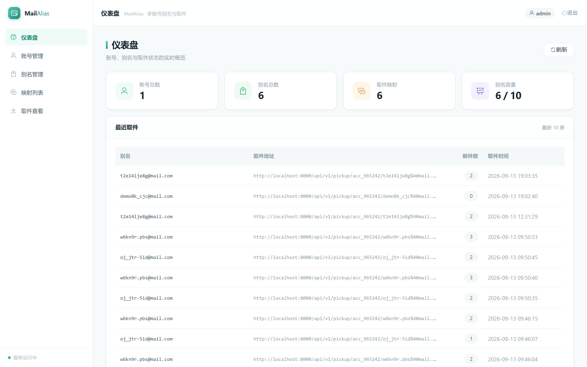
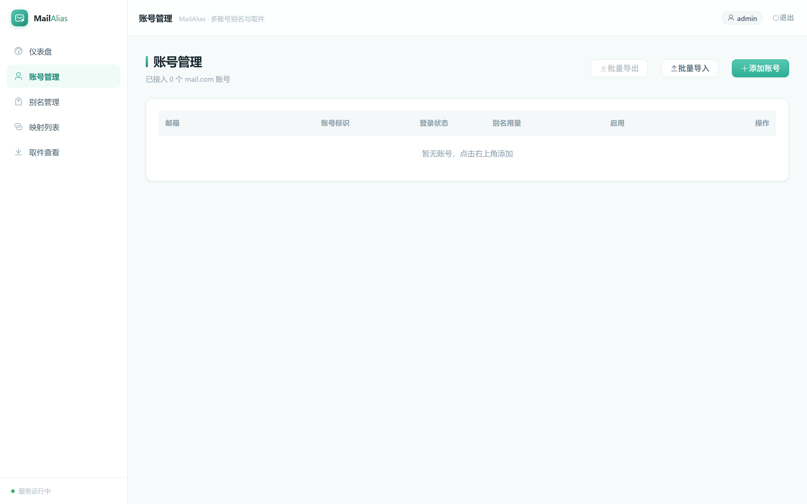
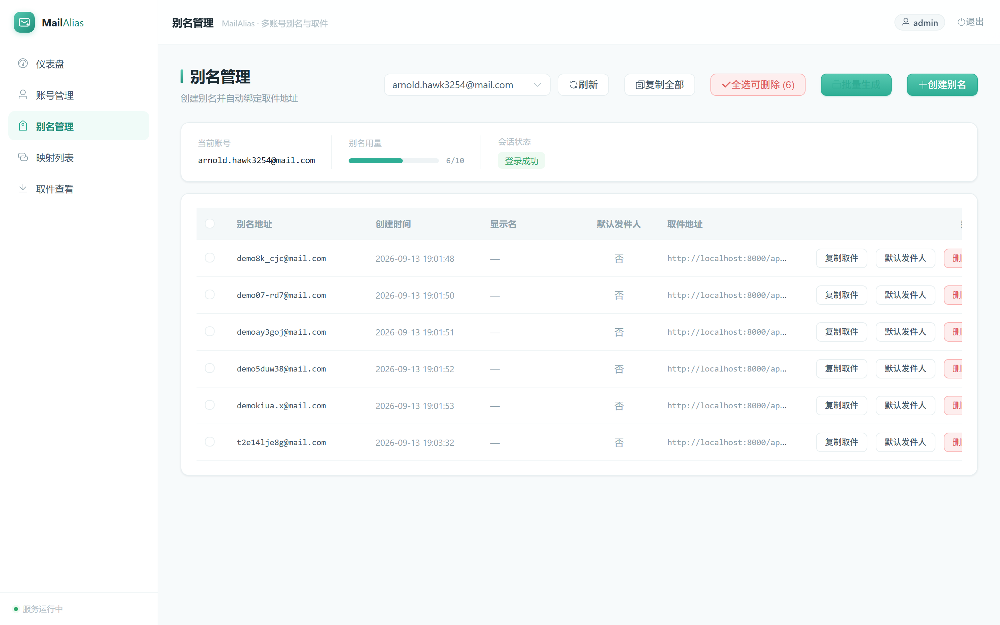
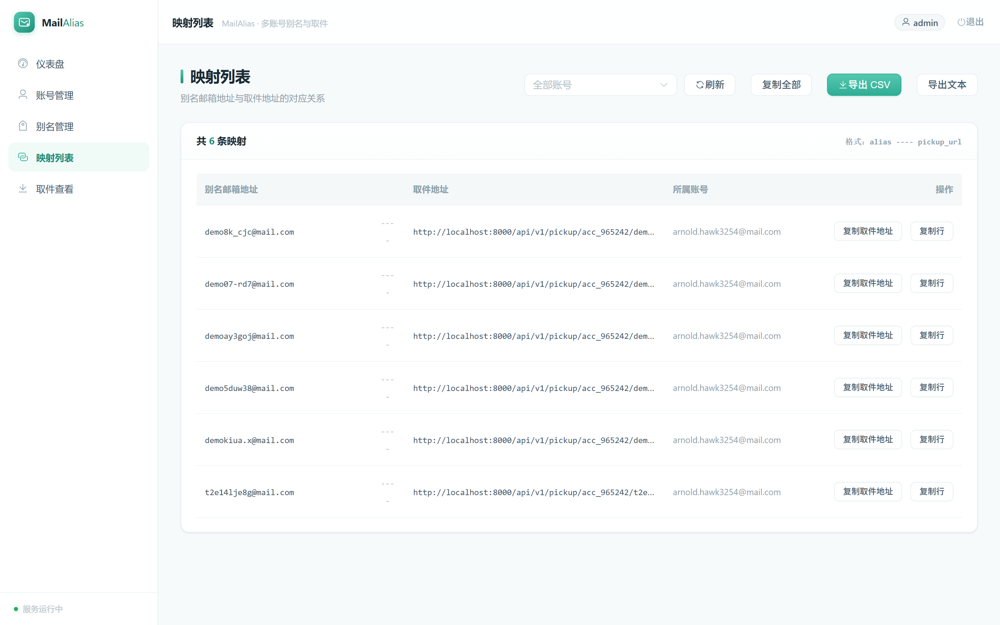
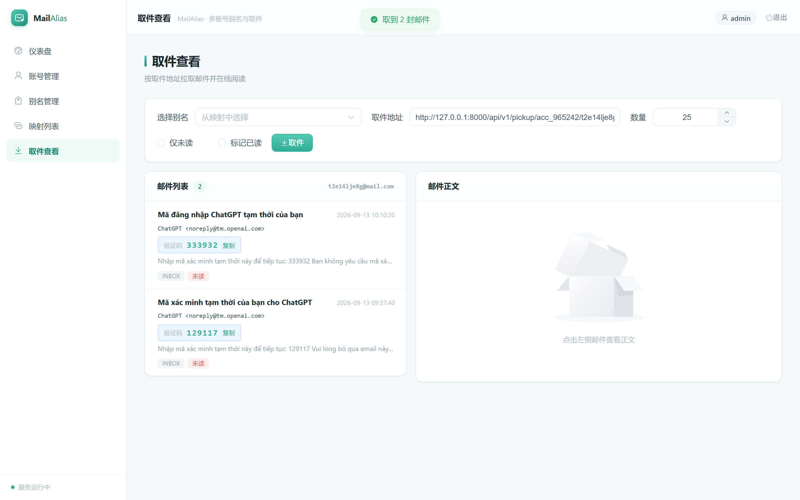

# MailAlias

多账号 mail.com 别名管理与取件系统：多账号配置、别名批量生成、别名—取件地址映射，以及按取件地址拉取邮件并**自动提取验证码**。

```
别名邮箱地址 ---- 对应邮箱的取件地址
my-alias@mail.com ---- http://localhost:8000/api/v1/pickup/acc_ab12cd/my-alias@mail.com
```

## 界面预览

### 仪表盘

账号、别名与取件状态的实时概览。



### 账号管理

添加/批量导入账号、查看登录状态（登录中 / 登录成功 / 登录过期）、别名用量、批量导出凭据。



### 别名管理

按账号查看别名，支持**批量生成**（指定数量 + 后缀随机生成）、全选批量删除、一键复制全部映射。



### 映射列表

`别名 ---- 取件地址` 对应关系，支持筛选、复制与导出 CSV / 文本。



### 取件查看

按取件地址拉取邮件，**自动高亮并提取验证码**，支持复制与在线阅读正文。



## 技术栈

| 层 | 技术 |
| --- | --- |
| 前端 | Vue 3 + TypeScript + Vite + Element Plus + Pinia + Axios |
| 后端 | Python 3.11+ / FastAPI / Uvicorn / SQLAlchemy 2.x / SQLite |
| 接入 | 由 `maildotcom-sdk`(TS) 移植的 Python mail.com 接入层（OAuth 桥接 / CATS / 移动 API） |
| 安全 | Fernet 加密凭据、JWT 鉴权、PBKDF2 密码哈希 |
| 部署 | 前后端分离开发；生产由 FastAPI 托管前端构建产物（单进程） |

## 核心特性

- **多账号管理**：账号增删、批量导入（`邮箱----密码`）、凭据加密存储
- **别名批量生成**：指定数量与后缀，随机生成前缀，自动分配到还有额度的账号
- **别名批量删除**：表格多选 + 一键全选，单个失败不影响其他
- **取件隔离**：每个别名只返回投递到它自己的邮件，不会泄露主邮箱其它邮件
- **验证码提取**：从主题/正文摘要中智能识别验证码（多语言、支持分组格式）
- **登录状态机**：`未检测 / 登录中 / 登录成功 / 登录过期 / 登录失败` 可视化
- **并发登录去重**：同一账号并发请求共享一次登录结果，避免触发风控
- **会话缓存**：域名与别名列表本地缓存，减少上游请求
- **容错**：令牌桶限流、指数退避重试、熔断、`stale` 降级

## 目录结构

```
├── docs/                      # 设计文档、接口契约、截图
│   ├── 前端所需后端API契约.md   # ← 前后端接口唯一约定来源
│   ├── mail.com-多账号别名与取件-设计方案.md
│   └── screenshots/           # 界面截图
├── frontend/                  # Vue 3 SPA
├── backend/                   # FastAPI 服务
└── maildotcom-sdk/            # 参考用 TypeScript SDK
```

## 快速开始

### 1. 构建前端

```bash
cd frontend
npm install
npm run build          # 产出 dist/
```

### 2. 启动后端（会自动托管 frontend/dist）

```bash
cd ../backend
uv venv .venv --python 3.12 --clear
uv pip install --python .venv/Scripts/python.exe \
  "fastapi>=0.115.0" "uvicorn[standard]>=0.32.0" "httpx>=0.28.0" \
  "sqlalchemy>=2.0.36" "pydantic-settings>=2.6.0" "cryptography>=44.0.0" \
  "python-jose[cryptography]>=3.3.0" "python-multipart>=0.0.20" "email-validator>=2.2.0"
cp .env.example .env
.venv/Scripts/python.exe -m uvicorn app.main:app --host 127.0.0.1 --port 8000
```

访问：

- 界面 http://127.0.0.1:8000/
- 接口文档 http://127.0.0.1:8000/docs
- 默认管理员 `admin` / `admin123`

### 开发模式（前端热更新）

```bash
# 终端 1：后端
cd backend && .venv/Scripts/python.exe -m uvicorn app.main:app --reload --port 8000
# 终端 2：前端（Vite 将 /api 代理到 8000）
cd frontend && npm run dev     # http://localhost:5173
```

## 功能页面

| 页面 | 功能 |
| --- | --- |
| 登录 | 用户名/密码登录，保存 JWT，401 自动跳转 |
| 仪表盘 | 账号数、别名数、映射数、别名容量、最近取件 |
| 账号管理 | 增删账号、批量导入/导出、验证会话、登录状态、别名用量 |
| 别名管理 | 查看/创建/批量生成/批量删除别名、设默认发件人、复制全部 |
| 映射列表 | `别名 ---- 取件地址`，支持复制、导出 CSV/文本 |
| 取件查看 | 拉取邮件、验证码高亮、查看 HTML/纯文本正文 |

## 接口契约

完整的前后端接口定义见 [`docs/前端所需后端API契约.md`](docs/前端所需后端API契约.md)。

## 测试与检查

```bash
cd backend
.venv/Scripts/python.exe -m pytest tests -q
.venv/Scripts/python.exe -m ruff check app tests
```

## 安全提示

生产环境请务必修改 `.env` 中的 `MAILCOM_SECRET_KEY` 与 `JWT_SECRET`，收紧数据库文件权限，并通过 `CORS_ORIGINS` 限定允许来源。

界面中的「批量导出」会返回明文密码，请妥善保管导出结果。
